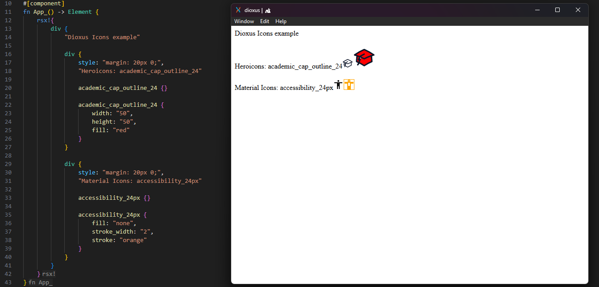

# Dioxus Icons



A library for using svg icons in Dioxus.

Icons are generated from official sources and are exported as an component for use in Dioxus.

> ⚠️ This project is in active development and not yet considered stable. Expect breaking changes before v1.0.

Currently supports:

- [Heroicons](https://heroicons.com/)
- [Material Icons](https://fonts.google.com/icons)

## Features

- ✅ Heroicons
- ✅ Material Icons
- 🛠️ Support the same icon sources as dioxus-free-icons
- 🚀 Designed for Dioxus, with a focus on icon customizability

## Getting Started

Clone the repo:

```bash
git clone https://github.com/norrchr/dioxus-icons.git
cd dioxus-icons
```

Run the example:

```bash
cd example
dx serve
```

## Icon resources

> ⚠️ Do not manually clone icon sources into the icon_resources directory

Run the following commands from the workspace root

This library makes use of sparse-checkout to reduce the size and scope of the icon sources, so only the required icon sources will be checked out.

Edit the config.json file to include the resources you want to use, and run the update command to download the sources

```bash
cargo run update
```

You can update a single resource by running:

```bash
cargo run update --name <resource_name>
```

Once this is done, you can build the library by running:

```bash
cargo run build
```

You can also build a single resource, but it's not recommended as it will not automatically import other resources which are already built.

```bash
cargo run build --name <resource_name>
```

This will generate the icon components in the packages/icons/src/icons directory.

